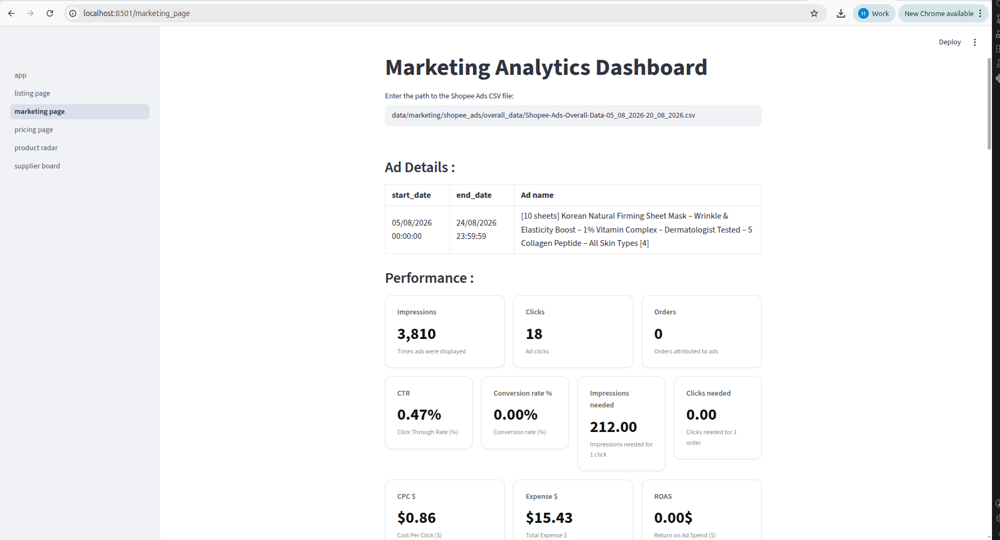
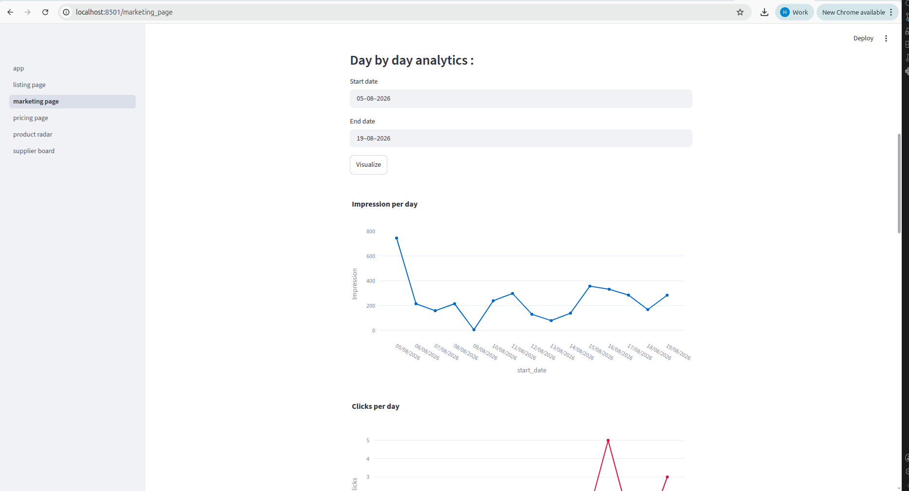
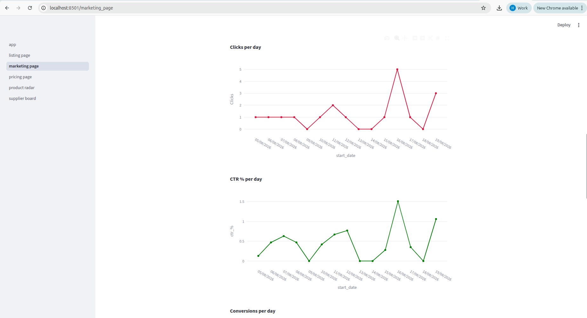
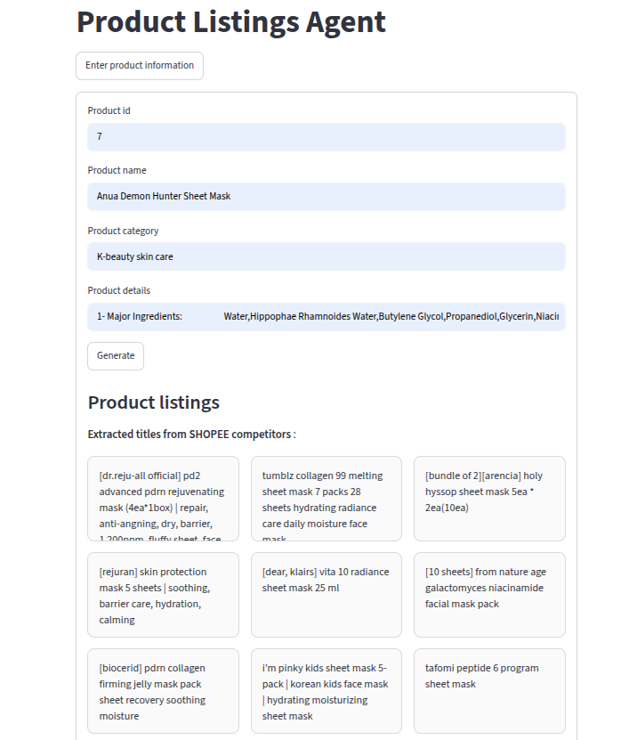
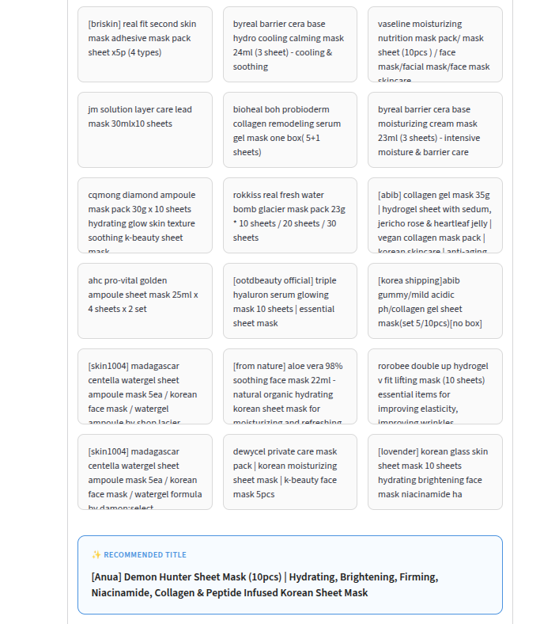
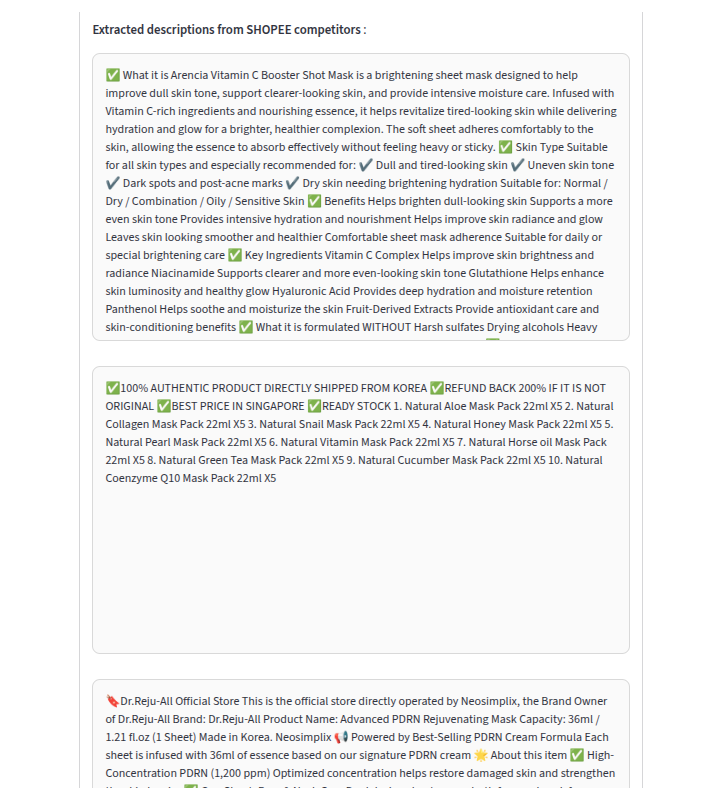
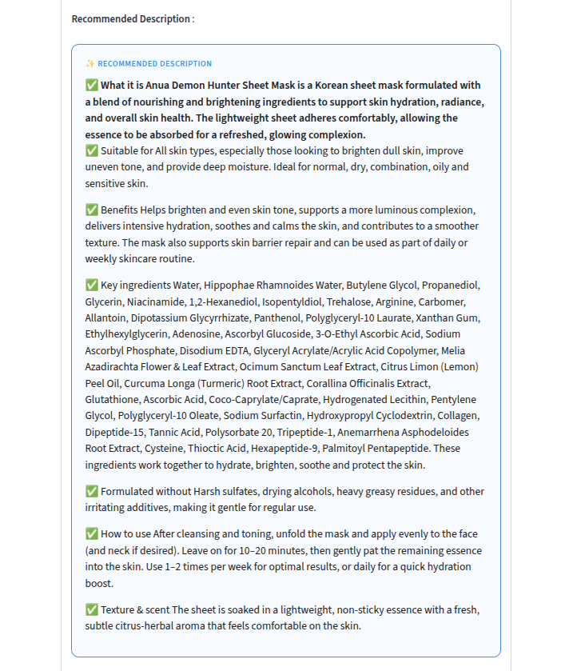
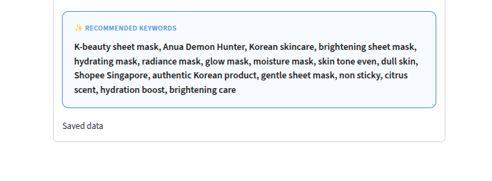

# Agentic Commerce

Traditional sellers, choose products, suppliers and prices using their intution and prior experience, 
they don't collect any data about the performance of their sells, so they can't evaluate their choices and decisions, and improve. 
We propose agentic commerce, an approach that relies on data, business rules and Agentic AI to choose products, suppliers, prices 
and monitor commerce performance to improve decision making. 

### Tools
Python 3.12.3

### Project screens

#### Product selection agent - Product scoring dashboard

#### Dynamic pricing agent - Pricing dashboard

#### Marketing Agent - Marketing analytics dashboard

#### Listing Dashboard

